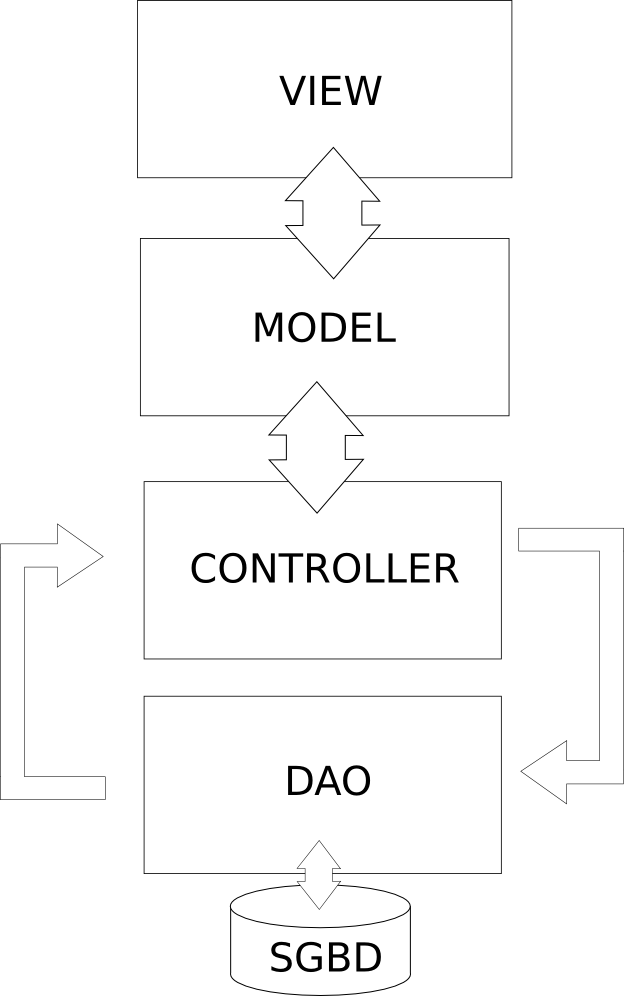

##Sistema de Gerenciamento de Processos UFBA

Trabalho da disciplina MATB09 - Laboratório de Banco de Dados.

Criação de um sistema que visa auxiliar os servidores da UFBA em sua atividade cotidianas.

###Padrão

***1 - Estrutura***

Utilização do modelo MVC - Model, View and Controller (Modelo, Visualização e Controle), com o auxilio de uma camada de acesso ao banco de dado, utilizada para manipulação dos dados entre a aplicação e o banco de dados (DAO, Data Access Object).

A figura 1 mostra a representação da estrutura do sistema.

Os imports globais estão localizados na classe Base.

***2 - Model***

O modelo são as classes. Adicionadas no repositório model com o modelo de nome padrão class.objeto_que_representa.php, cada objeto tem o seu model ou classe.

***3 - View***

Página que serão visualizadas pelo usuário.

***3.1 - Criação uma View***

Para criar uma view e poder acessá-la pela página é necessário criar o arquivo dentro da pasta **view/**, exemplo **nome_arquivo.php**, e então criar dentro da pasta **controller/** o arquivo **nome_arquivoController.php** com a classe **Nome_arquivoController** herdando de ActionController, a classe ficaria assim: 

<pre><code>class Nome_arquivoController extends ActionController{
    public function render(){
        Base::$page_title   = "nome_arquivo";
        parent::render();
    }
}</code></pre>

***4 - Controller***

Arquivos que farão a análise dos dados oriundos das View's, onde será feita as validações dos campos e regras de negócios, antes de passar para a camada de persistencia do banco.
